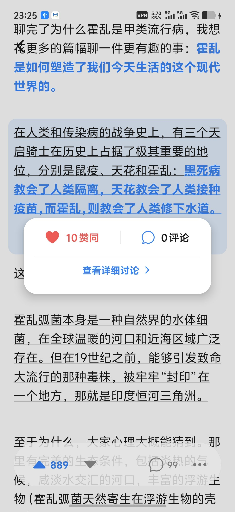

# 🐱 知乎-- (Zhihu Minus Minus)

> [!IMPORTANT]
> **🚧 项目声明**：本项目目前核心功能基本稳定，但仍有不完善之处；知乎 API 的变动也可能导致部分功能失效。
>
> 欢迎提交 Issue、Pull Request 或 Fork 参与改进。也可以看看其他客户端：
> - <https://github.com/zhihulite/Hydrogen>  
> - <https://github.com/zly2006/zhihu-plus-plus>


一款轻量、无广告的第三方知乎客户端，支持 **Android 与 iOS**。

## ✨ 特性

- **纯净浏览**：推荐、热榜、关注、同城和知乎日报，支持全站与用户内容搜索。
- **舒适阅读**：支持回答详情与预览卡片列表，可选原生或网页排版；详情默认左右切换同题回答，明确用户来源时切换该用户的回答。
- **自由定制**：调整主题色、深浅色模式、阅读背景与按压反馈，支持 RE2 正则屏蔽内容、去重推荐；推荐流广告与营销过滤默认开启。
- **创作互动**：写回答、文章，发想法、提问题；支持本地草稿、图片评论和想法投票。
- **个人内容**：创作汇总、多收藏夹、浏览历史同步；用户主页可查看你赞同过的该用户回答。
- **视频播放**：正文和独立视频直接获取播放资源，在应用内使用原生播放器，支持暂停、拖动进度和全屏。
- **图片复用**：头像、封面和普通配图优先使用已有缓存，减少重新进入页面时的重复加载；缓存由系统管理和淘汰。
- **账号切换**：支持多账号，也可用游客模式免登录浏览。
- **更新与隐私**：应用内检测新版，Android 支持下载安装；崩溃报告和匿名统计可随时关闭。

## 📸 界面预览

<div align="center">
  <table style="border-collapse: separate; border-spacing: 15px;">
    <tr>
      <td align="center" valign="top">
        
        <br /><br />
        <b>搜索</b><br />
      </td>
      <td align="center" valign="top">
        
        <br /><br />
        <b>问题详情</b><br />
      </td>
      <td align="center" valign="top">
        
        <br /><br />
        <b>夜间模式</b><br />
      </td>
      <td align="center" valign="top">
        
        <br /><br />
        <b>关注更新</b><br />
      </td>
      <td align="center" valign="top">
        
        <br /><br />
        <b>段落交互</b><br />
      </td>
    </tr>
  </table>
</div>

## 📦 下载与安装

### 🤖 Android

你可以直接前往 [GitHub Releases](https://github.com/huamurui/zhihu-minus-minus/releases) 下载最新的 APK 文件进行安装。

> [!NOTE]
> 请留意 APK 文件名。GitHub Release 会提供 `arm64-v8a`、`armeabi-v7a`、`x86` 和 `x86_64` 四个单 ABI APK；`arm64-v8a` 是默认验证过的主包，其余 `compat-*` 包目前主要用于兼容设备和模拟器，未完成完整实机验证。应用内更新会根据设备 ABI 选择匹配附件。

也可以从源码构建：

1. `git clone` 本仓库。
2. 安装环境（参考下方的 **快速开始**）。
3. 生成原生工程并运行本地 EAS 构建：

```bash
npm run prebuild
eas build --platform android --profile preview --local
```

本地 EAS 构建需要 Expo Token；如果启用了 telemetry，还要准备对应的 Firebase 配置文件和 Sentry 环境变量，详见 [数据统计与错误上报](./docs/TELEMETRY.md)。

Windows 无法运行 `eas build --local`，请使用 [Windows 本地构建指南](./docs/BUILD_WINDOWS.md) 中的 Gradle 流程。

### 🍎 iOS

本应用不会在 App Store 上架。
[GitHub Releases](https://github.com/huamurui/zhihu-minus-minus/releases) 会提供未签名 IPA；需要用户自行处理签名和安装环境。

- 当前原生配置的 iOS 最低版本为 **15.1**。Release 中的 IPA 未签名，不能直接当作可安装成品使用。

使用 **SideStore 或 AltStore Classic** 时，可以添加以下订阅源，从源中安装并在侧载工具内更新应用：

```text
https://github.com/huamurui/zhihu-minus-minus/releases/latest/download/altstore-source.json
```

该地址会在首次包含 `altstore-source.json` 的正式 Release 发布后生效，并跟随最新正式版本更新；临时构建和草稿 Release 不会更新公开源。适用于普通 IPA 侧载，签名和续期仍由侧载工具处理。源格式与兼容说明见 [AltStore 官方文档](https://faq.altstore.io/developers/make-a-source) 和 [SideStore 官方文档](https://docs.sidestore.io/docs/advanced/app-sources)。

如果你有 mac，可以试试自己打包：

1. `git clone` 本仓库。
2. 安装环境（参考下方的 **快速开始**）。
3. 使用自己的 Apple ID 在 Xcode 中进行签名并编译到真机。

```bash
npm run prebuild -- --platform ios
(cd ios && pod install)
npx expo run:ios --configuration Release --device
```

如果 `npx expo run:ios` 在较新的 Xcode 上无法完成签名或安装，建议打开生成的 `ios/*.xcworkspace`，在 Xcode 中选择自己的 Team 后直接 Build。

## 🚀 快速开始

完整的环境、原生重建、调试和测试说明见 [开发指南](./docs/DEVELOPMENT.md)，Windows 构建及其他专题见 [文档目录](./docs/README.md)。

本项目涉及到一些原生库，推荐使用 **Development Build** 进行开发。

基础环境：

- Node.js **22.x（推荐）**、npm；
- Android：JDK 17、Android SDK、ADB 或模拟器；
- iOS：macOS、Xcode、CocoaPods；
- EAS CLI 仅在使用 EAS 构建时需要。

1. **安装依赖**

```bash
npm ci
```

2. **生成原生项目目录**

```bash
npm run prebuild
```

`android/` 与 `ios/` 是生成物且不会提交到仓库。修改原生依赖、config plugin、原生配置或 `app.json` 后需要重新运行 prebuild；只修改 TypeScript/样式时通常不需要。

3. **运行 Android**（需要 ADB 或模拟器环境）

```bash
npm run android
```

4. **运行 iOS**（需要 Mac 且安装 Xcode）

```bash
npm run ios
```

### 提交前验证

```bash
npm run check
```

`npm run check` 会依次执行 TypeScript、Biome、全部测试和富文本 fixture 分析。全仓只读检查也可单独运行 `npm run lint`；需要应用 Biome 修复时使用 `npm run lint:fix`，并逐项复核改动。

富文本模块的目录约定、fixture 与专项命令见 [features/rich-content/README.md](./features/rich-content/README.md)。更多开发约定见 [DEVELOPMENT.md](./docs/DEVELOPMENT.md)；面向自动化开发者的维护规则见 [AGENTS.md](./AGENTS.md)。

## 🔐 登录说明

由于知乎 API 的安全性限制（X-ZSE-96 等），目前采用 WebView 自动拦截方案：

- 打开应用 -> 进入“我的” -> 点击登录按钮。
- 在弹出的登录界面完成登录。
- 升级首次读取会迁移旧明文账号，保留已有账号。保存或密钥失败时可在“我的”页重试；只有明确确认“清除本地账号”才清除所有账号。存储与设备恢复边界见 [账号保存与恢复](./docs/AUTH_STORAGE.md)。

## 🤝 贡献与声明

- **免责声明**: 本项目仅供学习交流使用，不建议用于商业用途。
- **License**: GPL-3.0 license

### 👥 贡献者 (Contributors)

<a href="https://github.com/huamurui/zhihu-minus-minus/graphs/contributors">
  
</a>

---
**Version**: v0.8.0 | **Last Updated**: 2026-10-05
